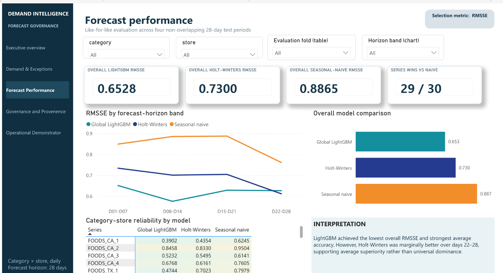
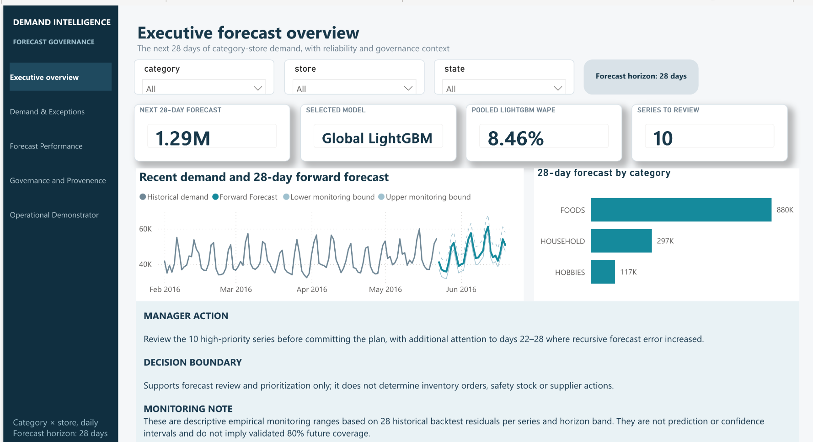
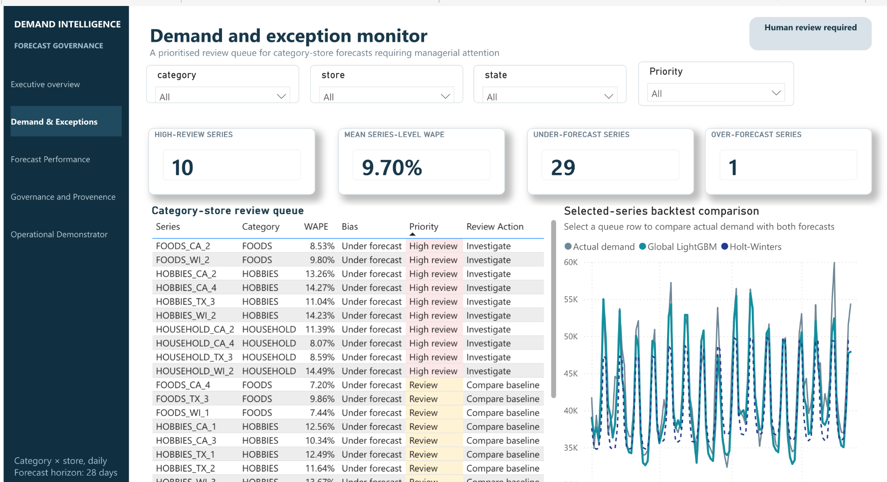
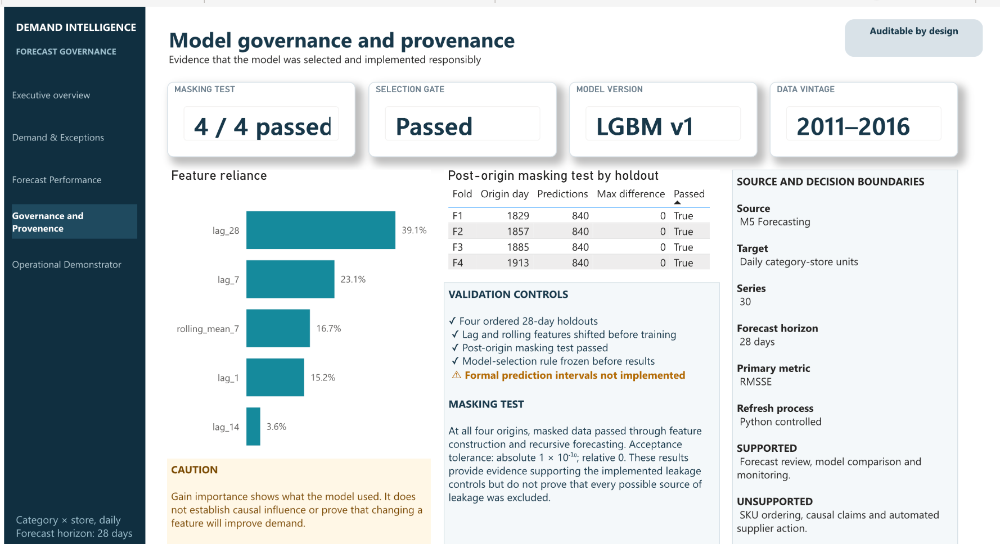
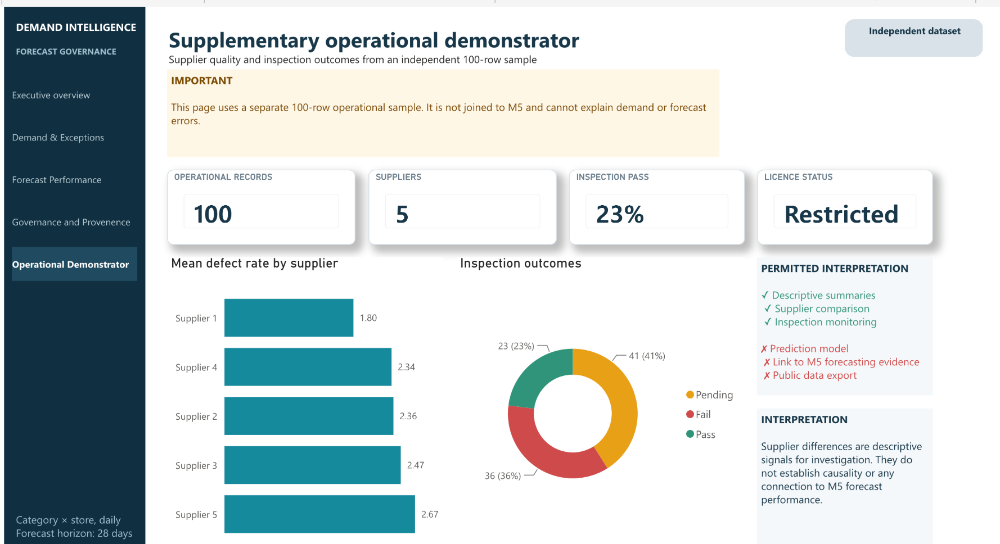
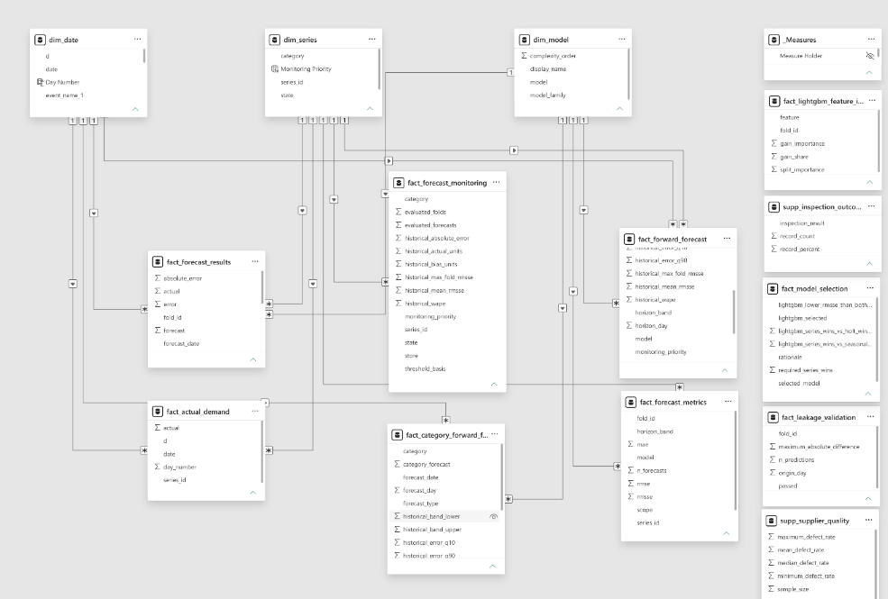

# Explainable Category-Store Demand Forecasting and Forecast Governance

My MSc Business Analytics dissertation at Queen's University Belfast investigates a practical retail planning problem: producing defensible 28-day demand forecasts at category-store level and giving decision-makers enough evidence to use those forecasts responsibly.

The study transforms 58,230 daily observations into 30 category-store series, evaluates three forecasting approaches through four ordered backtests, tests the winning pipeline for leakage and robustness, and carries the result into a five-page Power BI decision product. The outcome is not simply a model score. It is a traceable forecasting and governance framework that connects historical demand, model selection, exception review and management action.



## Executive result

| Outcome | Evidence |
|---|---:|
| Selected model | Global recursive LightGBM |
| Overall RMSSE | **0.6528** |
| Overall WAPE | **8.46%** |
| Out-of-sample forecasts across 3 models | **10,080** |
| Holt-Winters RMSSE | **0.7300** |
| Seasonal-naive RMSSE | **0.8865** |
| Series wins vs seasonal naive | **29 / 30** |
| Series wins vs Holt-Winters | **19 / 30** |
| Leakage masking checks | **4 / 4 passed** |

LightGBM produced the strongest aggregate result and won every evaluation fold. The decision was not treated as universal, however: Holt-Winters was better for 11 individual series and recorded a slightly lower RMSSE over forecast days 22-28. The recommended operating model is therefore LightGBM as the primary forecast, supported by series-level exceptions and horizon-level monitoring rather than blind automation.

## Why the project matters

Retail forecasting becomes operationally useful only when the method fits the decision. A category-store manager needs more than the model with the lowest overall error. They also need to know:

- whether the comparison used information that would genuinely have been available at each forecast origin;
- whether performance is stable across stores, categories and forecast horizons;
- where a simpler benchmark remains competitive;
- which demand series require manual review; and
- how forecast evidence should be communicated without implying false precision.

The dissertation addresses those questions as one connected system. It combines statistical baselines, machine learning, ordered validation, explainability, model-selection controls and a Power BI handoff designed around review and accountability.

## Research and analytical design

```text
M5 item-store demand
        |
        v
Aggregate to 30 category-store series x 1,941 days
        |
        v
Create four ordered 28-day forecast origins
        |
        +--> 7-day seasonal-naive benchmark
        +--> fixed Holt-Winters benchmark
        +--> global recursive LightGBM
                      |
                      v
    leakage tests + complexity gate + robustness checks
                      |
                      v
       28-day forward forecast + Power BI governance layer
```

The global LightGBM model learns across all 30 series while retaining category and store identity. Lagged demand, rolling statistics and calendar features are created using only information available at the relevant forecast origin. Predictions are generated recursively across all 28 days, so later forecast steps cannot see actual demand from earlier days inside the same future window.

### Evaluation controls

- Four non-overlapping temporal folds; no random train/test split.
- Identical forecast origins and scoring rules across all three models.
- Training-only RMSSE scales and training-only lagged or rolling features.
- Recursive multi-step forecasting across the complete 28-day horizon.
- Post-origin target masking repeated across every fold: 840 predictions compared per fold, maximum absolute difference `0.0`.
- A model-complexity gate defined before the final comparison.
- Performance inspected by fold, series and seven-day horizon band rather than only as one aggregate.
- Sensitivity and paired-model checks retained alongside the headline model selection.

## What I built

I designed the research question and evaluation framework, prepared the category-store data, implemented the statistical baselines and global recursive LightGBM pipeline, created the validation and governance controls, and translated the final evidence into Power BI.

The public repository separates reusable logic from the submitted notebooks:

- `src/` contains data preparation, baselines, LightGBM, evaluation, model selection and governance modules;
- `scripts/` provides repeatable entry points for each pipeline stage;
- `tests/` checks paths, metrics, model-selection rules and governance logic;
- `outputs/metrics/` retains aggregate evidence from the archived dissertation run; and
- `docs/` records the research design, feature availability, provenance and Power BI model.

This structure makes the analytical decisions inspectable without publishing restricted row-level data or university-only paths.

## Submitted Power BI decision product

The images below are the exact dashboard captures included in the submitted technical report and show the implemented Power BI pages. The `.pbix` remains private because it embeds source data and local paths.

### 1. Executive forecast overview



The opening page combines forward demand, category and store selection, forecast profile, model reliability and a management summary. Its purpose is to let a reviewer understand both the operational outlook and the strength of the historical evidence behind it.

> The submitted screenshot preserves an earlier manager-action sentence. The verified horizon table is authoritative: Holt-Winters recorded a lower RMSSE than LightGBM on days 22-28 (`0.6119` vs `0.6269`), while LightGBM remained the best model overall.

### 2. Demand and exception monitor



This page turns the forecast into a review queue. It surfaces category-store combinations whose recent behaviour, forecast change or historical model performance warrants attention, supporting human investigation instead of automatic replenishment decisions.

### 3. Forecast performance


The performance page compares LightGBM, Holt-Winters and seasonal naive by metric, fold, category, store and horizon band. It makes the aggregate win visible while preserving the places where simpler methods remain competitive.

### 4. Model governance and provenance



This page records model selection, feature reliance, leakage tests and provenance. It was designed to make the forecast challengeable: a reviewer can see what was selected, why it was selected and which controls support that choice.

### 5. Operational demonstrator



The final page demonstrates how forecast evidence could sit alongside stock and supplier signals in an operational workflow. It uses a separate, independent 100-row demonstration dataset and is not joined to the M5 forecasting data; the boundary is deliberate and stated in the technical report.

### Semantic model



The Power BI implementation contains 35 DAX measures, 15 Power Query definitions and 13 relationships. The semantic model separates forecasting facts, model evidence, dates and operational demonstration tables so that filters and measures remain traceable.

## Management interpretation

The evidence supports a governed deployment pattern:

1. use the global LightGBM forecast as the default category-store planning signal;
2. retain Holt-Winters and seasonal naive as visible challengers;
3. review series and horizon exceptions before operational action;
4. monitor future errors by the same folds, horizons and series used in validation; and
5. keep ordering, safety stock and supplier decisions outside the model until inventory, service-level and lead-time data are properly integrated.

This distinction matters. The dissertation supports forecast selection and review; it does not claim to automate SKU replenishment, purchase orders or causal demand interventions.

## Repository guide

| Path | Purpose |
|---|---|
| `notebooks/02...04` | Executed preparation, evaluation and full-history forecasting workflow |
| `notebooks/05...` | Power BI preparation and governance workflow; private demonstrator removed from the public notebook |
| `src/` | Reusable data, model, evaluation, selection and governance modules |
| `scripts/` | Command-line entry points for each pipeline stage |
| `tests/` | Unit tests for metrics, paths, selection and governance logic |
| `outputs/metrics/` | Aggregate, non-row-level evidence used in this README |
| `dashboard/submitted-power-bi/` | Exact captures from the submitted technical report |
| `docs/` | Research design, feature availability, provenance and dashboard schema |

## Reproduce the analysis

The raw and processed M5 records are not redistributed. Download the official M5 Forecasting - Accuracy files from Kaggle and place them under `data/raw/m5/` as described in [`data/README.md`](data/README.md).

```bash
python -m venv .venv
source .venv/bin/activate
python -m pip install -r requirements.txt
python -m unittest discover -s tests -v
python scripts/verify_public_repository.py
```

Run the notebooks in numerical order or use the command-line scripts. The repository includes the submitted aggregate metrics so the published claims can be checked without redistributing competition data.

The public code uses the neutral seed `42`; the saved metrics are the evidence table from the archived submitted run. A complete rerun may show small numerical variation while retaining the same research design and decision logic.

## Technical stack

Python · pandas · NumPy · statsmodels · LightGBM · scikit-learn · Jupyter · Power BI · DAX · Power Query · temporal cross-validation · feature engineering · model governance

## Boundaries and limitations

- This is a historical forecasting study based on the M5 competition, not a live 2026 demand forecast.
- Residual bands are descriptive monitoring ranges rather than calibrated prediction intervals.
- Feature importance describes model reliance, not causality.
- Category-store forecasts do not replace SKU-level inventory, lead-time or service-level modelling.
- The operational demonstrator is intentionally separate from the forecasting dataset.

## Author

**Muhammad Ahmed Shoaib**<br>
MSc Business Analytics, Queen's University Belfast<br>
Forecasting · retail analytics · supply-chain decision support · model governance
