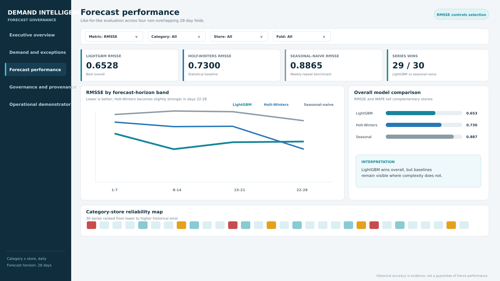
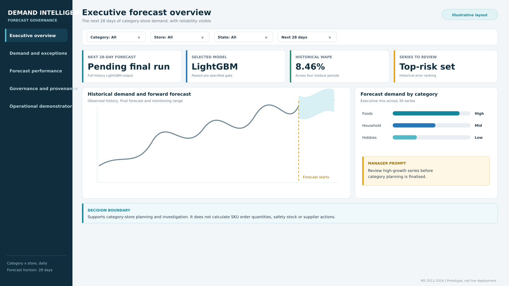
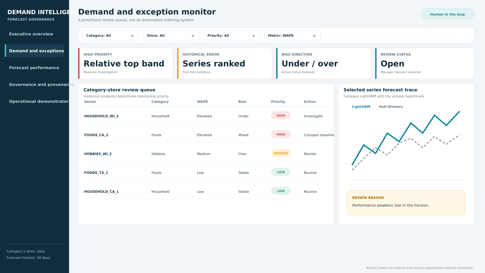
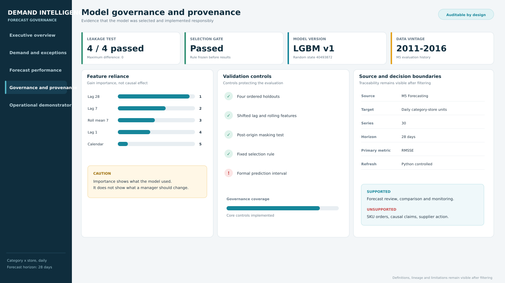

# Retail Demand Forecasting & Governance

An end-to-end retail forecasting system built for a real planning question: **which model should a supply-chain manager trust for the next 28 days, where is it likely to fail, and how should that evidence be governed?**

This was my MSc Business Analytics dissertation at Queen's University Belfast. I developed the research design, Python forecasting pipeline, evaluation framework, validation controls and five-page Power BI implementation.



## Executive result

| Outcome | Evidence |
|---|---:|
| Best model | Global recursive LightGBM |
| Overall RMSSE | **0.6528** |
| Overall WAPE | **8.46%** |
| Historical backtest forecasts | 10,080 |
| Series wins vs seasonal naive | **29 / 30** |
| Series wins vs Holt-Winters | **19 / 30** |
| Leakage masking checks | **4 / 4 passed** |

LightGBM outperformed both baselines overall and in every evaluation fold. I retained the counter-evidence as well: Holt-Winters was better for 11 series and slightly stronger over forecast days 22–28. The deployment decision is therefore a governed model choice, not a claim that one model dominates everywhere.

## Why this project matters

Forecast accuracy alone is not enough for an operational decision. The solution connects five pieces that are often separated:

1. a defined 28-day category-store planning decision;
2. time-ordered backtesting against credible baselines;
3. recursive feature generation that prevents future information entering predictions;
4. explicit selection, leakage and robustness controls;
5. a Power BI handoff designed for exception review rather than automated ordering.

The result is a portfolio-grade example of translating machine learning into a decision process that a planning stakeholder can inspect.

## Analytical design

```text
M5 item-store demand
        |
        v
30 category-store series x 1,941 days
        |
        v
Four ordered 28-day backtests
        |
        +--> Seasonal naive (7-day)
        +--> Holt-Winters (fixed specification)
        +--> Global recursive LightGBM
                      |
                      v
      leakage tests + complexity gate + robustness checks
                      |
                      v
        28-day forward forecast + Power BI governance layer
```

### Evaluation controls

- Four non-overlapping temporal folds; no random train/test split.
- Training-only RMSSE scales and lagged/rolling features.
- Recursive multi-step forecasts, so each future step uses only information available at its origin.
- Post-origin target masking repeated across all four folds: 840 predictions compared per fold, maximum absolute difference `0.0`.
- A model-complexity gate specified before comparing final results.
- Performance broken down by fold, series and seven-day horizon band.

## Dashboard product

The Power BI design provides:

- an executive view of forward demand and model reliability;
- a category-store exception queue for human review;
- fold, series and horizon-level model comparison;
- model-selection, feature-reliance and leakage evidence;
- explicit boundaries: no SKU replenishment, purchase-order or causal claim.

| Executive review | Exceptions | Governance |
|---|---|---|
|  |  |  |

The submitted `.pbix` is intentionally not public because it embeds restricted data. Screenshots and the documented star schema show the implemented product without redistributing source records.

## Repository guide

| Path | Purpose |
|---|---|
| `notebooks/02...04` | Executed preparation, evaluation and full-history forecasting workflow |
| `notebooks/05...` | Public Power BI preparation and governance workflow; private demonstrator removed |
| `src/` | Reusable data, model, evaluation, selection and governance modules |
| `scripts/` | Command-line entry points for each pipeline stage |
| `tests/` | Unit tests for metrics, paths, selection and governance logic |
| `outputs/metrics/` | Aggregate, non-row-level evidence used in this README |
| `docs/` | Research design, feature availability, provenance and dashboard schema |

## Reproduce the analysis

The raw and processed M5 records are not redistributed. Download the official M5 Forecasting - Accuracy files from Kaggle and place them under `data/raw/m5/` as described in [`data/README.md`](data/README.md).

```bash
python -m venv .venv
source .venv/bin/activate
python -m pip install -r requirements.txt
python -m unittest discover -s tests -v
python scripts/verify_public_repository.py
```

Run the notebooks in numerical order or use the command-line scripts. The repository includes the submitted aggregate metrics so the published claims can be checked without redistributing the competition data.

The public code uses the neutral seed `42`; the saved metrics are the evidence table from the archived submitted run. A complete rerun may therefore show small numerical variation while retaining the same evaluation design.

## Technical stack

Python · pandas · NumPy · statsmodels · LightGBM · scikit-learn · Jupyter · Power BI · temporal cross-validation · feature engineering · model governance

## Responsible-use boundary

This is a historical, portfolio forecasting case based on the M5 competition. It is not a live 2026 demand forecast. Residual bands are descriptive monitoring ranges, not calibrated prediction intervals. Feature importance describes model reliance, not causality.

## Author

**Muhammad Ahmed Shoaib** — Business analytics, supply chain, forecasting and decision support.
